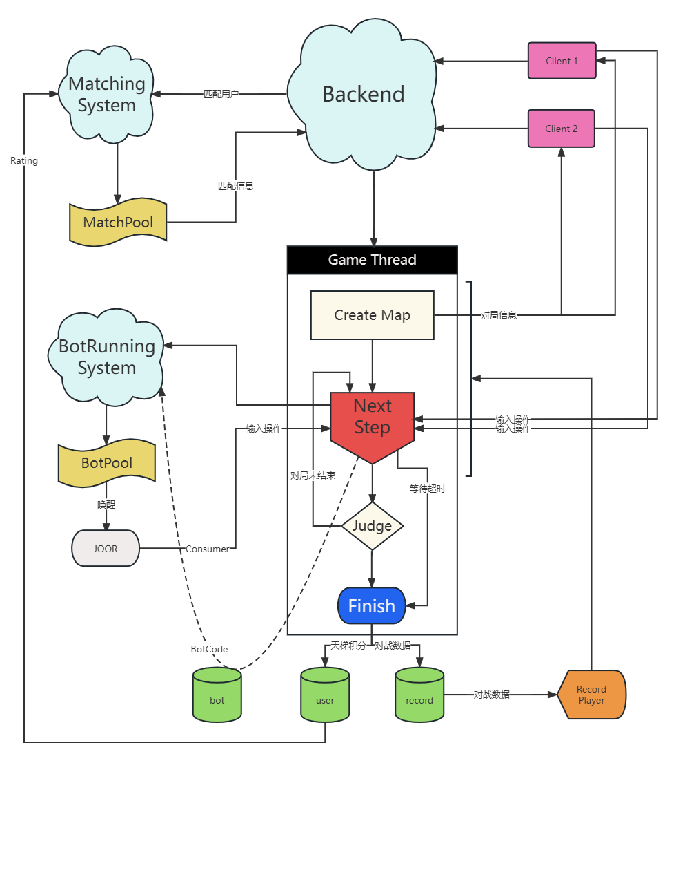

# King Of Bots


大一下大作业 Vue 3 + SpringBoot 2.7 完整的较高完成度的上线项目


### 已使用到的技术：

前端：Vue 3、vuex、vue-router、bootstrap、WebSocekt、jwt-token

后端：Springboot、MyBatis-plus、SpringSecurity、SpringCloud、MySql、WebSocekt、多线程与锁、restTemplate线程注入、微服务pom依赖管理、MySql数据库设计

运维：Linux、git、**docker、宝塔

客户端：windows平台封装web ui


### 考虑融入的技术：

前端：Vite、pinia、element-plus、TypeScript

后端：大一上期中写的php邮箱发信服务器（仅差接入）、图片验证码生成系统（重构EPL源码）、人脸识别系统（仅差接入）、**OAuth 2第三方授权验证**、**Redis**、Nacos、Feign、RabbitMQ、SpringCloudeAlibaba体系

运维：kubernates

客户端：成为Unreal 5项目引入的一个模块


***粗体部分为即将实现模块


## 项目结构分析：

### 微服务：

#### BackendApplication

主要后端服务，所有与前端界面的请求交互均通过此服务实现

#### MatchingSystemApplication

匹配系统独立模块，使用轮询线程检测匹配池用户，根据扩散原则匹配对应用户并返回结果

#### BotRunningSystemApplication

AI代码运行服务，目前为demo版本，仅运行支持java代码（通过反射），后期考虑提升服务器性能并使用Runtime类启动docker编译运行代码以确保即使响应与后端安全，从Buffer中取出运行结果。

使用可唤起线程实现AI代码编译运行。


### 业务流程：



### 数据库结构：

```sql
create table bot
(
    id          int auto_increment
        primary key,
    user_id     int            not null,
    title       varchar(128)   not null,
    description varchar(356)   null,
    content     varchar(10000) null,
    create_time datetime       null,
    modify_time datetime       null,
    constraint id
        unique (id)
);

create table record
(
    id          int auto_increment
        primary key,
    a_id        int           null,
    a_sx        int           null,
    a_sy        int           null,
    b_id        int           null,
    b_sx        int           null,
    b_sy        int           null,
    a_steps     varchar(1000) null,
    b_steps     varchar(1000) null,
    map         varchar(1000) null,
    loser       varchar(10)   null,
    create_time datetime      null,
    constraint id
        unique (id)
);

create table user
(
    id       int auto_increment
        primary key,
    username varchar(128)     not null,
    password varchar(128)     not null,
    photo    varchar(1024)    null,
    rating   int default 1500 not null,
    constraint id
        unique (id)
);


```


## 致谢


​		这个项目是一份作业，更是本人对大一下学期所学到的大部分技术的总结，也算是给自己一个勉强凑合的交代了吧。越过了一个障眼的小山丘后才看到了群峦起伏的广阔世界，山中虽有虎，可对远方与浪漫的向往令马蹄碎亦不停。


​		感谢李双治学长对本人后端技术栈的漫长道路认知的挖掘，感谢研发室进阶组所有学长的前端知识与软件工程框架的指导，感谢韩玉艳老师、李寰老师、王玉亭老师（按字典序排序）提供的学习环境，感谢我深爱着的世界和所有人。


​		最后，感谢计算机，感谢我头顶的宇宙，你是我此生见过最美丽的姑娘。	